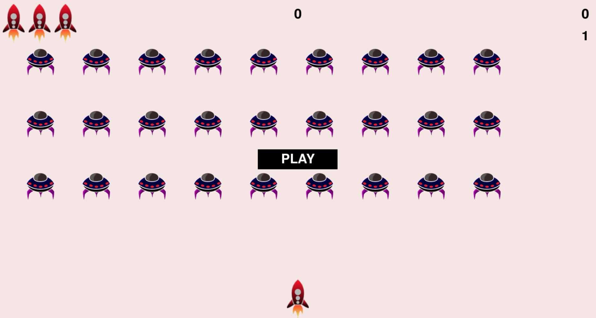

# Alien Invasion
I created this game by following the "Python Crash Course" book by Eric Matthes, to improve my Python skills. In this project I have used the Pygame package to develop a 2D game in which the aim is to shoot down a fleet of aliens as they drop down the screen in levels that increase in speed and difficulty. This is one of the favourite games of my childhood.

# Introduction

In Alien Invasion, a spaceship is present at the bottom of the screen, which can be controlled using arrow keys and spacebar.
- Right Arrow : Spaceship moves to the right.
- Left Arrow  : Spaceship moves to the left.
- Spacebar    : Spaceship shoots bullets.

Objective of the game is stop the fleet of aliens from reachng the bottom of the screen and our spaceship, if any of these happens then the player loses the spaceship. In the game player have three extra spaceships.

# Requirements
- Python 3.x
- Pygame

To play just run the alien_invasion.py and save our world from the aliens.
